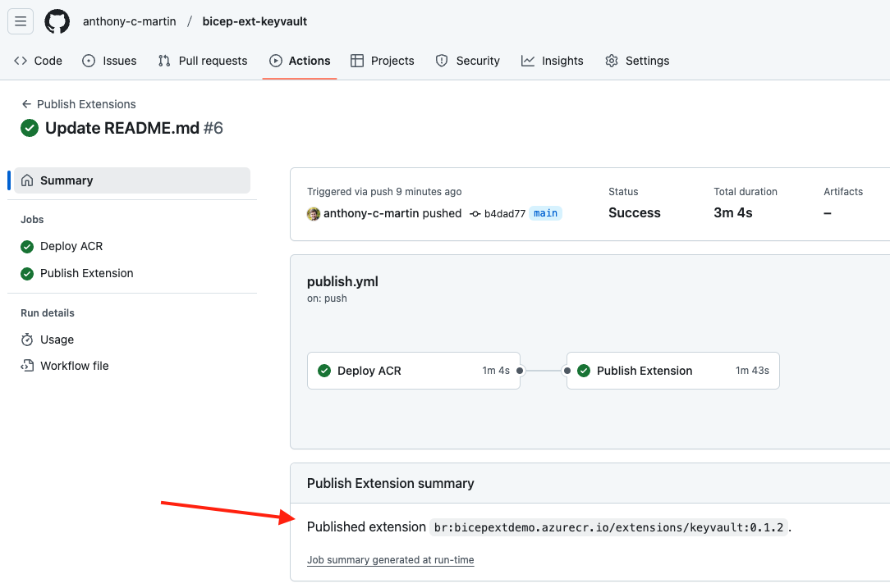

# Http Bicep Extension

An example extension for Bicep Local, allowing you to make an HTTP request as part of a Bicep Deployment.

This repo has all the scaffolding needed to build and automate publishing of a more complex extension for any scenario, using Go.

## Usage

1. Download the [Samples folder](https://download-directory.github.io/?url=https%3A%2F%2Fgithub.com%2Fanthony-c-martin%2Fbicep-ext-http%2Ftree%2Fmain%2Fsamples), and unzip it.
1. Open the unzipped Samples folder in VSCode, and select one of the `.bicepparam` files you wish to deploy.
1. Launch the [Deploy Pane](https://github.com/Azure/bicep/blob/main/docs/experimental/deploy-ui.md) to run the deployment.

> [!NOTE]
> Extension binary packages are not signed on a Mac. If you see the following error, you will need to manually sign the extension package:
> 
> `Failed to launch provider: Failed to connect to provider /Users/ant/.bicep/br/bicepextdemo.azurecr.io/extensions$http/0.1.1$/extension.bin`
> 
> To work around it, run the following in a terminal window, using the path from the error message:
> 
> `codesign -s - '/Users/ant/.bicep/br/bicepextdemo.azurecr.io/extensions$http/0.1.1$/extension.bin'`

## Build + Test Locally

### Rebuild the extension
These commands publish the extension to the local file system, and updates the sample bicepconfig to point to the local extension.
```sh
./scripts/publish.sh ./bin/bicep-ext-http
jq '.extensions.http="../bin/bicep-ext-http"' ./samples/bicepconfig.json > ./samples/bicepconfig.new.json
mv ./samples/bicepconfig.new.json ./samples/bicepconfig.json
```

### Test the extension
Run the deployment.
```sh
~/.azure/bin/bicep local-deploy ./samples/basic/main.bicepparam
```

To enable verbose tracing, run the following beforehand.
```sh
export BICEP_TRACING_ENABLED=true
```

## Publishing to a registry
This repo is set up with GitHub Actions to publish a new version to an ACR on every push to the `main` branch.

To pick up a new version after publishing, view the [Publish Extension output](https://github.com/anthony-c-martin/bicep-ext-http/actions/workflows/publish.yml), and update your bicepconfig.json to use the new spec:



### First time setup
To configure the GitHub Actions automation for the first time:

Log in to Azure CLI. Customize and run `./scripts/initial_setup.sh`.

## Building other extensions

This repo is also intended to demonstrate how to build + publish an end-to-end Bicep extension in C#. Feel free to copy, rename and modify it to prototype building an extension to extend other services.